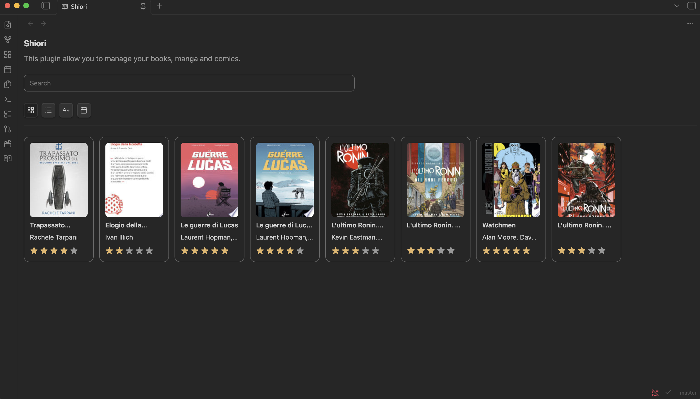
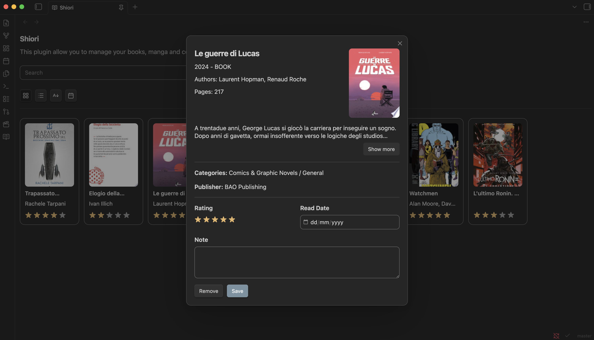
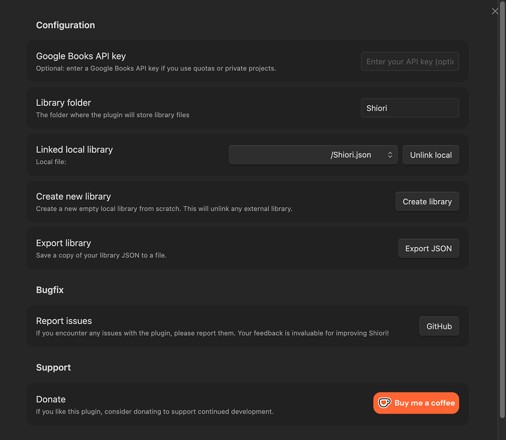

# Shiori — Libreria di Letture (Libri, Manga & Fumetti)

Plugin per Obsidian che consente di cercare, salvare e gestire le proprie letture (libri, manga, fumetti). Supporta ricerche tramite provider esterni (es. Google Books), salvataggio della libreria in un file JSON nella vault e gestione di stato/valutazioni.

## Caratteristiche principali

- Ricerca di volumi tramite API esterne e import rapido dei metadati.
- Libreria locale strutturata in un file JSON salvato nella vault.
- Stato di lettura (`read`), valutazioni a stelle e note personali.
- UI responsive con modalità `grid` o `list`, modali di dettaglio e widget di rating.

## Demo

##### Features
<p style="text-align: center;">
    
    
</p>

##### Settings
<p style="text-align: center;">
    
</p>

## Requisiti
- Node.js >= 22.16.0 (per sviluppo e build)

## Installazione
1. Copia i file compilati nella cartella del plugin dentro la vault: `.obsidian/plugins/obsidian-shiori/`.
2. Ricarica Obsidian.
3. Abilita il plugin in Settings → Community Plugins.
Per lo sviluppo, posiziona la repository direttamente nella vault per abilitare hot-reload.

## Sviluppo
Comandi principali (root del progetto):

```bash
npm install
npm run dev # sviluppo: esbuild + watch sass
npm run build # build di produzione
```

## Configurazione

### API Key (opzionale)

Per estendere le ricerche o ottenere più dettagli puoi usare una API key (es. Google Books). Inserisci la chiave nelle impostazioni del plugin.

### Cartella e file della libreria

Di default la libreria viene salvata in una cartella configurabile dentro la vault (vedi impostazioni del plugin). Il file JSON può essere creato/caricato/salvato tramite l'interfaccia del plugin.

## Quick Start

1. Apri la view del plugin dalla ribbon o dal comando disponibile.
2. Usa la barra di ricerca per trovare un volume.
3. Apri il dettaglio e usa le azioni per aggiungere alla libreria, segnare come letto o valutare.

## Struttura del progetto (sintetica)

```
src/
├── main.ts                    # Entrypoint plugin
├── constants.ts
├── services/
│   ├── bookService.ts         # API e normalizzazione risultati
│   └── storage.ts             # Creazione / caricamento / salvataggio JSON
├── settings/
│   └── settingsTab.ts         # UI impostazioni
├── ui/                        # Componenti UI e modali
└── views/
    └── libraryView.ts         # View principale
```

For technical details and data models, see `TECHNICAL.md`.

**Version**: 1.0.0
**Minimum Obsidian Version**: 0.15.0

If you want to support development: https://ko-fi.com/vittorioscaperrotta